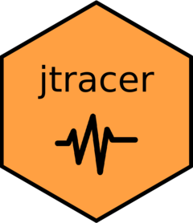

<!-- README.md is generated from README.Rmd. Please edit that file -->

```{r, include = FALSE}
knitr::opts_chunk$set(
  collapse = TRUE,
  comment = "#>",
  fig.path = "man/figures/README-",
  out.width = "100%"
)
```

# jtracer 

<!-- badges: start -->
[](https://lifecycle.r-lib.org/articles/stages.html#experimental)
[](https://github.com/bilingual-project/jtracer/actions)
[](https://circleci.com/gh/bilingual-project/jtracer)
<!-- badges: end -->

This package provides an R interface to jTRACE, a re-implementation of the **TRACE** model of spoken word recognition (McClelland & Elman, [1986](https://www.sciencedirect.com/science/article/pii/0010028586900150)) created by Strauss, Harris & Magnusson ([2007](https://magnuson.psy.uconn.edu/jtrace/)). Using the functions in this package you can generate the files you need to perform simulations in jTRACE.

## What is jTRACE?

From jTRACE [website](https://magnuson.psy.uconn.edu/jtrace/):

> TRACE is a highly influential model of spoken word recognition, created by McClelland and Elman (1986). The original implementation of that model, which we call “cTRACE,” was used to run dozens of simulations comparing TRACE’s behavior with results from experimental studies with human subjects. TRACE’s behavior accounted for human behavior in a number of important ways, and it is still frequently cited as the canonical interactive-activation model of word recognition.

## Installation

You can install it from [GitHub](https://github.com/) with:

``` r
# install.packages("devtools")
devtools::install_github("bilingual-project/jtracer")
```

## Installing and launching jTRACE

First, you need to download jTRACE. You can do it from the R console running:

```r
jtracer::jtrace_install()
```

This will download the jTRACE folder from [https://magnuson.psy.uconn.edu/jtrace/](https://magnuson.psy.uconn.edu/jtrace/). This function will also check if a sufficiently recent version of Java is up and running (>1.4). If not, it will prompt you to do it. 

Once an appropriate version of Java is up and running and jTRACE has been installed, you will be able to launch jTRACE with:

```r
jtracer::jtrace_launch()
```

## Extracting a lexicon from jTRACE

jTRACE has multiple lexica available to perform simulations. By default, it offers:

* biglex_lr
* biglex_lr_^a
* biglex901
* context_lex
* empty
* initial_lexicon
* sevenlex
* slex
* slex_pairs

You can import a lexicon from jTRACE as a data frame with `jtrace_get_lexicon`. For example:

```{r lexicon, echo=TRUE}
library(jtracer)
lex <- jtrace_get_lexicon(lexicon = "slex")
head(lex)
```


## Extracting a language

jTRACE includes a default language, which consists on a matrix with the scores of a series of phonemes across the seven feature dimensions considered by the TRAC model, a matrix with the duration score of each phoneme in each feature, and a matrix of logical values indicating the allophonic relations between phonemes. You can extract this language by running:

```{r get}
jtrace_get_language(language_name = "default")
```

As you create new languages (see next section), you will be able to extract them using the same command.

## Creating a new language

We can create new languages by creating a set of phonemes and scoring them across the seven feature dimensions the TRACE model considers. The `jtrace_create_language` takes care of generating a file jTRACE can read and run simulations with.

The `jtrace_create_language` takes, at least, a character value indicating the name you want to give your new language, a vector or phonemes (in jTRACE notation) of length M, and a M x 7 matrix or data frame with the scores (0-9) of each phoneme (rows) in each of the feature dimensions (columns). If the feature data frame includes row names with valid phoneme symbols, you can omit the `phonemes` argument. Optionally, you can also provide duration values (0-1) for each phoneme in each feature as a M x 7 matrix with same dimensions as the one provided in the `features` argument, and/or a M x M matrix stating allophonic relations between phonemes (with logical values, TRUE/FALSE). See the documentation for more details (`?jtrace_create_language`).

### Generate a phoneme inventory

First, we create a character vector with the phoneme symbols:

```{r phonemes}
p <- c("-", "a", "s", "d", "f", "g", "c") 
```

Then, we create a the features matrix (please note that scores are assigned randomly, and this example is not supposed to reflect a real-life case):

```{r features}
f <- data.frame(
  bur = c(9, 6, 4, 3, 1, 1, 2),
  voi = c(7, 4, 3, 3, 3, 3, 4),
  con = c(8, 2, 4, 2, 5, 5, 6),
  grd = c(4, 6, 1, 4, 6, 8, 6),
  dif = c(6, 3, 2, 6, 6, 6, 7),
  voc = c(3, 8, 1, 6, 6, 7, 4),
  pow = c(6, 4, 1, 6, 1, 1, 5)
)
```

Of course, it can be cumbersome to create a data frame like this. An alternative would be to create a table in an Excel spreadsheet and importing it to your R session or copy-pasting it into your console using the "Paste as tribble" adding from the [datapasta](https://github.com/MilesMcBain/datapasta) R package. 

We are all set up now!

```{r create}
jtrace_create_language(
  language_name = "custom",
  phonemes = p,
  features = f
)
```

As the output says, you new language has been converted to a .jt file that is noew ready to be imported in jTRACE. You can launch jTRACE from your console by running `jtrace_launch()`. You will find the language at ".jtrace/languages/custom.jt" (see `.jtrace$PATH` to see where the .jtrace folder is located) in your machine.


You can also get your language by running:

```{r get_language}
jtrace_get_language(language_name = "custom")
```

This will return a list with the feature, duration, and allophones matrices.

