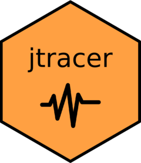

<!-- README.md is generated from README.Rmd. Please edit that file -->

# jtracer 

<!-- badges: start -->

[](https://lifecycle.r-lib.org/articles/stages.html#experimental)
[](https://github.com/gongcastro/jtracer/actions)

[](https://circleci.com/gh/gongcastro/jtracer)
[](https://codecov.io/gh/gongcastro/jtracer?branch=master)


<!-- badges: end -->

This package provides an R interface to jTRACE, a re-implementation of
the **TRACE** model of spoken word recognition (McClelland & Elman,
[1986](https://www.sciencedirect.com/science/article/pii/0010028586900150))
created by Strauss, Harris & Magnusson
([2007](https://magnuson.psy.uconn.edu/jtrace/)). Using the functions in
this package you can generate the files you need to perform simulations
in jTRACE.

## What is jTRACE?

From jTRACE [website](https://magnuson.psy.uconn.edu/jtrace/):

> TRACE is a highly influential model of spoken word recognition,
> created by McClelland and Elman (1986). The original implementation of
> that model, which we call “cTRACE,” was used to run dozens of
> simulations comparing TRACE’s behavior with results from experimental
> studies with human subjects. TRACE’s behavior accounted for human
> behavior in a number of important ways, and it is still frequently
> cited as the canonical interactive-activation model of word
> recognition.

## Installation

You can install it from [GitHub](https://github.com/) with:

``` r
# install.packages("devtools")
devtools::install_github("bilingual-project/jtracer")
```

## Installing and launching jTRACE

First, you need to download jTRACE. You can do it from the R console
running:

``` r
jtracer::jtrace_install()
```

This will download the jTRACE folder from
<https://magnuson.psy.uconn.edu/jtrace/>. This function will also check
if a sufficiently recent version of Java is up and running (&gt;1.4). If
not, it will prompt you to do it.

Once an appropriate version of Java is up and running and jTRACE has
been installed, you will be able to launch jTRACE with:

``` r
jtracer::jtrace_launch()
```
