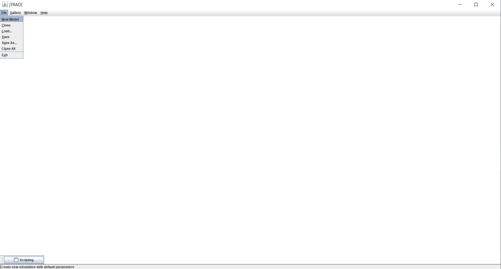
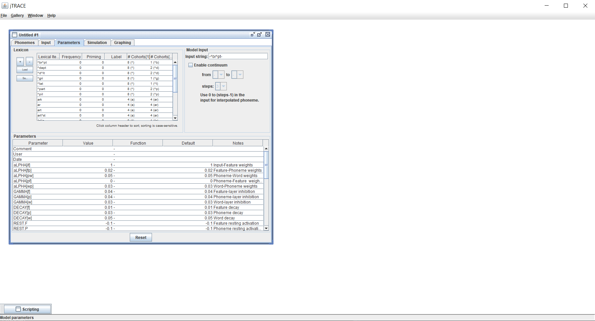
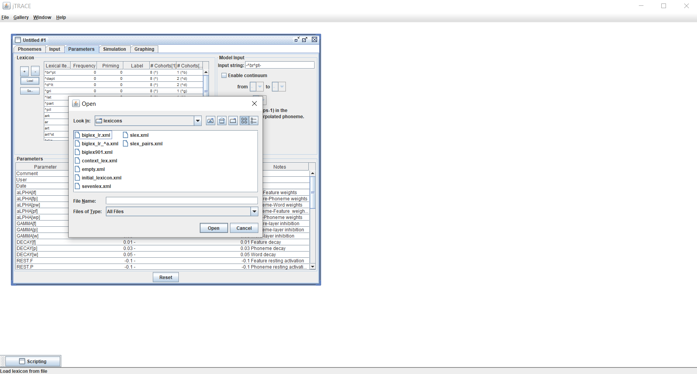
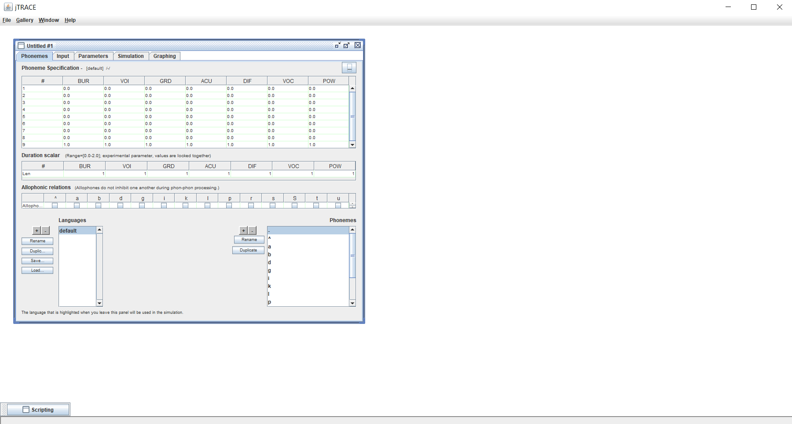
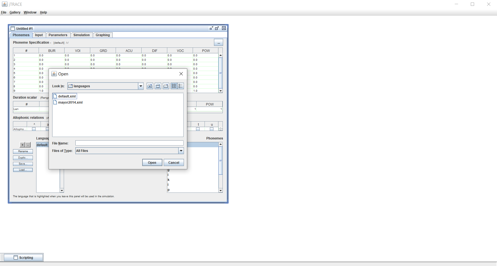
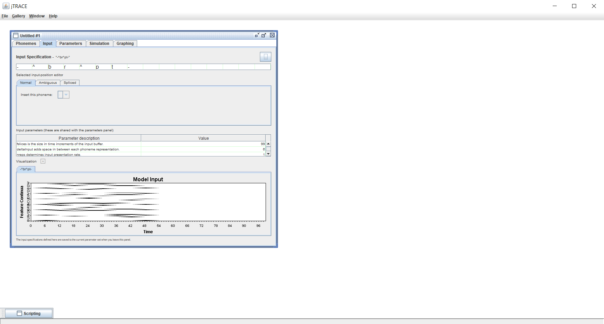
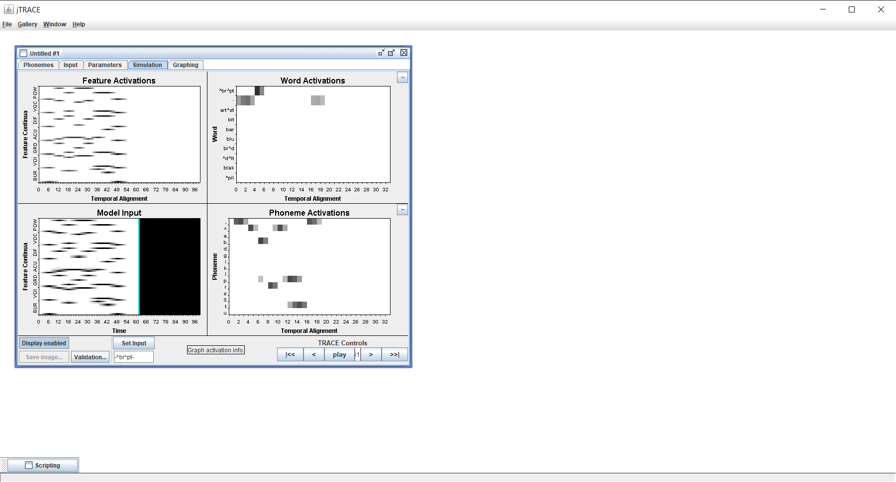
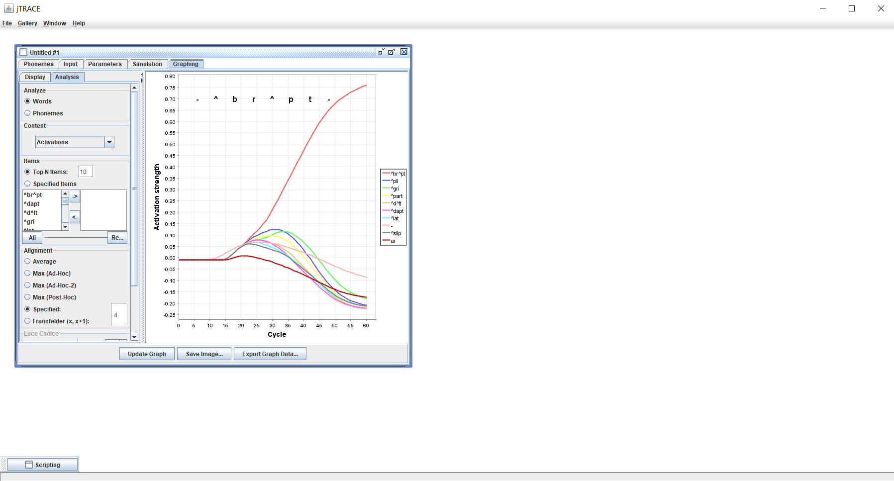

```{r, include = FALSE}
knitr::opts_chunk$set(
  collapse = TRUE,
  comment = "#>"
)
```

```{r setup}
library(jtracer)
jtrace_install()
```


Although you could manually navigate to the jTRACE folder--located at the "jtrace" folder inside the jtracer package folder (probably the first path in `.libPaths()`)--we recommend launching jTRACE from your R session by running:

```r
jtrace_launch()
```

This will open jTRACE and make your custom languages and lexicons available. In case you have not installed jTRACE yet, you will be prompted to run `jtrace_install` to do so. Once jTRACE is launched, you can run new simulations by clicking *File > New model*.


```{r jtrace_screenshot1, echo=FALSE, message=FALSE, warning=FALSE, paged.print=FALSE}

```

This will open a new window, in which you will be able to change the parameters of the model. This window has several tabs: *Phonemes*, *Input*, *Parametes*, *Simulation*, and *Graphing*. The *Parameters* tab is shown by default. In this tab, you will be able to add a custom lexicon for your simulations by clicking *Load* in the *Lexicon* box. The lexicon added by default is named `default`. You can inspect it running `jtrace_get_lexicon("default")` in your console.


```{r jtrace_screenshot2, echo=FALSE, message=FALSE, warning=FALSE, paged.print=FALSE}

```

This will open a dialogue box showing the contents of the jTRACE folder. Navigate to *Lexicons* to see the available lexicons. If you have created any custom lexicon (see `jtrace_create_lexicon()`) it should appear in the list. Double click on the desired lexicon and you should be able to run your simulations.

```{r jtrace_screenshot3, echo=FALSE, message=FALSE, warning=FALSE, paged.print=FALSE}

```

In the *Phonemes* tab you will be able to change the language (a.k.a. phoneme set) available to the TRACE model during the simulations. The language selected by default is name "default". You can inspect in by runing `jtrace_get_language("default")` in your R console.

```{r jtrace_screenshot4, echo=FALSE, message=FALSE, warning=FALSE, paged.print=FALSE}

```

You can make small changes to the scoring of each phoneme across the feature dimensions in the table shown in the top part of the *Phonemes* tab. However, if you want to use a custom language we recommend creating a new language using the `jtrace_create_language()` function and then loading it into the jTRACE session.You can load a new language by clicking *load* in the bottom part of the *Phonemes* tab. This will open a dialogue box showing the contents of the jTRACE folder. Navigate to *Languages* to see the available languages. If you have created a custom language using `jtrace_create_language()`, it should be listed in the folder. Double click your desired language and it will be loaded into the jTRACE session.

```{r jtrace_screenshot5, echo=FALSE, message=FALSE, warning=FALSE, paged.print=FALSE}

```


Finally, specify and acoustic input in the top part of the *Input* tab (all phonemes must be present in the language you have selected to run the simulation, otherwise the simulation will stop with an error).

```{r jtrace_screenshot6, echo=FALSE, message=FALSE, warning=FALSE, paged.print=FALSE}

```


Your simulations are now ready to be run with your custom lexicon and/or language! Navigate to the *Simulation* tab and click the *Play* button in the bottom-right part of the tab. The behaviour of the model and its outputs will be shown in real time in the *Simulation* and *Graphing* tabs.

```{r jtrace_screenshot7, echo=FALSE, message=FALSE, warning=FALSE, paged.print=FALSE}

```

```{r jtrace_screenshot8, echo=FALSE, message=FALSE, warning=FALSE, paged.print=FALSE}

```
